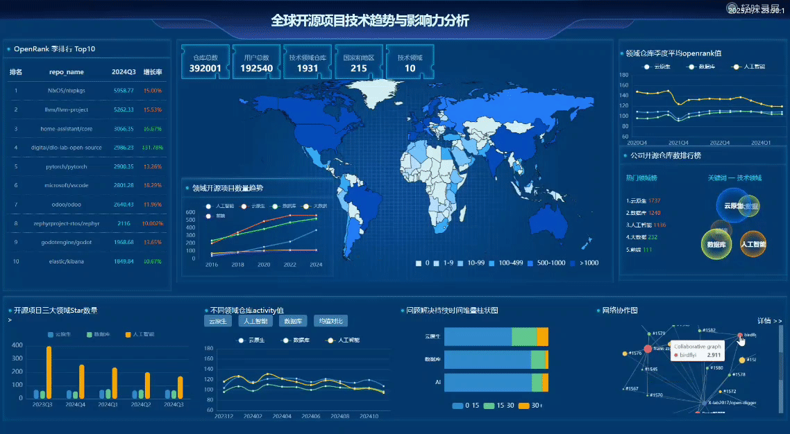

# Open-Rank：开源项目技术趋势与影响力分析

### 项目分工

| 姓名   | 学号        | 负责功能                                                     |
| ------ | ----------- | ------------------------------------------------------------ |
| 韩悦   | 10213903418 | 数据处理，activity、issue相关数据可视化，首页制作，仓库社区网络协作图，项目报告编写 |
| 贾馨雨 | 10235501437 | 数据处理，OpenRank、Stars相关数据可视化，项目报告编写，视频录制和GIF图制作 |
| 朱子玥 | 10230720412 | 数据处理，地理数据可视化，项目报告编写，PPT制作              |

## 第一部分：项目背景与设计目标

### **1.1 项目背景**

​		开源项目作为技术创新的重要驱动力，已经深刻改变了全球开发者和技术企业的运作模式。随着云计算、大数据、人工智能等新兴技术的兴起，开源项目不仅推动了技术的发展，还促进了全球协作和创新的蓬勃发展。特别是在 **GitHub** 和 **Gitee** 这两个平台上，成千上万的开源项目为开发者提供了丰富的技术资源和社区支持，构建了一个庞大的技术生态系统。

​		在开放的平台上，开源项目不仅推动了技术进步、降低了开发成本，还为开发者和技术企业提供了跨平台的协作机会。许多知名的技术和工具（如 Linux、Pytorch、TensorFlow、Kubernetes 等）都源自开源项目，这些项目为全球的技术公司提供了极大的价值，成为各大企业和技术团队的基础设施之一。然而，随着开源项目数量的激增和技术栈的多样化，开发者和企业面临着新的挑战。如何在众多的开源项目中识别出真正具备潜力和影响力的技术，如何在快速变化的开源生态中制定技术战略，成为开发者和技术决策者亟需解决的问题。

### **1.2 设计目标**

​		本项目的目标是通过对开源项目的技术趋势与影响力进行全面而深入的分析，帮助开发者、企业及其他利益相关者理解开源生态的变化和发展趋势。具体设计目标包括以下几方面：

1. **数据提取与分析**
   - 数据收集：从 GitHub 和 Gitee 平台收集开源项目的关键数据，包括**所属技术领域、所属公司 、OpenRank值、项目的活跃度、星标数、仓库社区**等。这些数据为分析开源项目的技术趋势和社区影响力提供了重要基础。
   - 技术趋势分析：开源项目技术栈的变化趋势直接反映了技术领域的发展方向。开发者和企业需要通过数据分析识别哪些**技术/公司**正在快速崛起，哪些**技术/公司**发展更加稳定。通过对各个项目领域/公司标签数据的提取与分类，得出近年来开源项目的热点领域及发展趋势，根据这些数据进行数据可视化，识别当前和未来的技术热点和发展方向。通过对开源项目的发展轨迹和技术演化过程的分析，找出技术领域中的潜在创新点。
   - 影响力评估：开源项目的影响力与其社区的**活跃程度**、**仓库社区协作网络**、**openrank值**、**星标数**等息息相关，如何评估这些影响力指标、帮助开发者和企业做出理智的技术选择，是开源项目分析中的重要问题。此外，**issue解决持续时间**是衡量项目社区参与度和问题响应效率的重要指标，也是评估项目影响力不可缺少的部分。
2. **数据清洗与可视化**
   - 数据清洗：对原始数据进行清洗，去除缺失值较多的数据和异常数据，对缺失值较少的数据插值处理。将提取的指标数据（如OpenRank值、项目的活跃度、星标数、仓库社区等）和项目所属技术领域/所属公司根据项目id进行连接，多角度分析不同领域/公司的开源项目。
   - 数据可视化：项目通过各种可视化手段展示分析结果，使得技术趋势、项目影响力、开发者活跃度等数据更加直观，帮助用户快速理解和使用分析结果。可视化的结果将有助于开发者和企业更好地掌握开源项目的动态，预测开源项目未来发展方向和趋势，提供决策支持。
3. **决策支持与推荐**
   - 开发者决策支持：为开发者提供技术选型、项目参与建议，帮助其选择适合的技术栈和开源项目。通过对项目活跃度和技术趋势的分析，帮助开发者识别和参与有潜力的项目，并提供贡献指导。
   - 企业战略支持：为企业提供开源技术的趋势预测和影响力分析，帮助企业了解当前和未来的技术方向。企业可以根据这些分析结果在技术研发、技术选型、合作伙伴选择等方面做出更加科学和有前瞻性的决策。
4. **提供开源生态发展建议**
   - 社区建设：通过对开源项目的社区活跃度、仓库社区的分析，提供促进开源项目社区建设和活跃度提升的建议。帮助项目维护者和开发者提高项目的社区影响力和协作效率。为决策者和开发者的投资及参与提供数据支持，结合这一系列指标找出健康度更高的项目。
   - 跨界合作与技术创新：通过对技术趋势的深度分析，推动跨领域的技术合作和创新。识别技术栈的变化和发展趋势，为开源项目和企业提供跨界合作和技术融合的机会，促进技术的快速发展和创新。

### 1.3 数据来源

本项目的数据来源主要包括以下两个平台：

- **GH Archive**：记录 GitHub 平台的公开事件日志，以 JSON 格式存储各种 GitHub 活动，全面覆盖 GitHub 平台的动态。
- **OpenDigger**：对GH Archive的原始数据进行解析与结构化存储，提供ClickHouse示例数据集与静态数据根链接，便于快速开展分析任务。

## 第二部分：具体实现

### **2.1 数据提取**

​		对于OpenDigger平台提供的静态数据根链接，我们使用 `aiohttp` 异步库向两个平台的每个仓库的 API 请求数据，若API 请求失败（例如网络错误、仓库不存在等）等情况，相应值用 `0` 填充。之后进行了数据清洗、数据整合。

1. **数据清洗**：对原始数据进行去噪、填充缺失值和格式转换，确保数据的准确性与一致性。
2. **数据整合**：将多个来源的数据整合为易于分析且更全面的格式，生成Excel文件或CSV文件。

本项目对开源项目的多个维度进行分析和处理，部分数据的处理与结果存储如下：

| 数据来源                           | 数据提取内容                          | 处理结果文件                   |
| ---------------------------------- | ------------------------------------- | ------------------------------ |
| **meta.json**                      | 提取 GitHub 用户 Location 信息        | `user_region_counts.csv`       |
| **meta.json**                      | 提取 GitHub 仓库技术领域字段（field） | `repo_list_github_field.xlsx`  |
| **meta.json**                      | 提取 Gitee 仓库所属公司名（company）  | `repo_list_gitee_company.xlsx` |
| **openrank.json**                  | 提取 GitHub 仓库季度 OpenRank 值      | `repo_github_openrank_Q.xlsx`  |
| **openrank.json**                  | 提取 GitHub 仓库月份 OpenRank 值      | `repo_github_openrank_M.xlsx`  |
| **openrank.json**                  | 提取 Gitee 仓库季度 OpenRank 值       | `repo_gitee_openrank_Q.xlsx`   |
| **openrank.json**                  | 提取 Gitee 仓库月份 OpenRank 值       | `repo_gitee_openrank_M.xlsx`   |
| **stars.json**                     | GitHub 仓库季度星标数                 | `repo_github_stars_Q.xlsx`     |
| **stars.json**                     | Gitee 仓库季度星标数                  | `repo_gitee_stars_Q.xlsx`      |
| **activity.json**                  | GitHub 仓库月份活跃度                 | `repo_github_activity_M.xlsx`  |
| **activity.json**                  | Gitee 仓库月份活跃度                  | `repo_gitee_activity_M.xlsx`   |
| **issue_resolution_duration.json** | GitHub 仓库最新季度（2024Q3）值       | `repo_field_issue_Q.xlsx`      |
| **issue_resolution_duration.json** | Gitee仓库最新季度（2024Q3）值         | `repo_field_issue_Q2.xlsx`     |

### 2.2 数据处理

#### 2.2.1 领域/公司数据

​		由于GitHub平台meta.json只能够提取到仓库的技术领域字段，Gitee平台只能够提取到中国开源仓库的公司字段，因此，为了分析开源项目的趋势与影响力，我们将项目分为两个部分——**全球开源项目技术趋势与影响力分析**和**中国开源项目技术趋势与影响力分析**。对于GitHub平台的全球开源项目数据，我们主要以技术领域字段对项目进行分类；对于Gitee平台的中国开源项目数据，我们主要以公司字段对项目进行分类。

​		我们项目利用GitHub平台提供的392001条开源项目数据、192540条用户数据。我们通过`meta.json`获取到1931条具有领域字段的仓库，共涉及到10个领域，包括云原生、数据库、人工智能、大数据、前端、操作系统、区块链、物联网等。根据各领域下的开源仓库数量，得到领域开源仓库数排行榜。此外，我们根据开源仓库协作者的用户数据的location字段提取出215个国家和地区的用户相对数值，结合世界地图进行可视化，颜色越深表示该地区参与开源项目的用户越多。

​		我们项目利用Gitee平台提供的29333条开源项目数据、167839条用户数据。我们通过`meta.json`获取到17321条具有公司字段的仓库，共涉及到8个领域，包括华为、阿里巴巴、开放麒麟、微众银行、百度、蚂蚁集团等。根据公司旗下的开源仓库数量，得到公司开源仓库数排行榜。此外，我们根据开源仓库协作者的用户数据的location字段提取出190个城市的用户相对数值，以此作为圆半径，结合中国地图将城市圆可视化，圆的半径越大表示该地区参与开源项目的用户越多。

#### 2.2.2 OpenRank数据

​		`OpenRank `是一个衡量 GitHub 全域项目与开发者之间协作网络节点重要性的指标，借鉴了活跃度指标来构建网络，使用活跃度作为开发者与仓库之间边的权重。OpenRank 值的计算不仅依赖于当月的协作网络结构，还部分依赖于节点在上个月的全域 OpenRank 值。这体现了开源生态中珍视长期价值的原则。与传统的 PageRank 不同，OpenRank 在计算中并未对开发者的加权活跃值进行开方运算，因为社区参与人数这一变量已经隐含在了全域协作网络的结构中。

​		OpenRank是用来衡量开源项目全球综合影响力的关键指标。本项目提取了Github平台和Gitee平台的OpenRank数据，并进行了最新季度（2024Q3）排名与变化率计算，结果见**OpenRank 季排行 Top10**板块。

​		我们将提取的OpenRank指标数据和项目所属技术领域/所属公司根据项目id进行连接，通过项目所属技术领域/所属公司对全球开源项目/中国开源项目进行分组，以提取到的openrank值最早出现的时间为该项目创建时间，为每组按年计数并累加，得到**领域开源项目数量趋势**和**公司开源项目数量趋势**。

​		对于GitHub平台提取仓库 2020Q4到 2024Q3的季度数据，对前三名的热门领域（云原生、数据库、人工智能）的仓库的openrank数进行可视化，生成折线图，从不同时间观察activity数量的变化，从而预测这个领域未来的发展趋势，结果见**领域仓库季度平均openrank值**；对于Gitee平台提取仓库 2022Q3到 2024 Q3的季度数据，对前三名的公司（华为、阿里巴巴、开放麒麟）的仓库的activity数进行可视化，生成折线图，从不同时间观察openrank数量的变化，从而预测这个领域未来的发展趋势，结果见**公司开源仓库季度平均openrank值**。

#### 2.2.3 星标数据

​		在GitHub和Gitee平台上，星标数代表了用户对某个项目或仓库的喜爱程度、关注程度以及项目的受欢迎程度。通过分析仓库的星标数，可以了解哪些项目在开发者中具有较高的知名度和认可度。星标数的增长可以反映出项目的受欢迎程度，而下降的星标数则可能表明项目的热度减退。我们将提取的`stars`季度指标数据和项目所属技术领域/所属公司根据项目id进行连接，通过项目所属技术领域/所属公司对全球开源项目/中国开源项目进行分组，对每组求`stars`季度指标数据的平均值，以反映这一技术领域/公司开源项目的受欢迎程度，结果见**开源项目三大领域季度平均Star数**和**开源项目三大公司季度平均Star数**。

#### 2.2.4 仓库活跃度数据

​		活跃度（Activity）是由 [X-lab 开放实验室](https://github.com/X-lab2017)定义的一个统计型指标，而仓库的活跃度计算方式为当月该仓库中所有开发者的活跃度总和，即$A_r = \sum A_u = \sum_u \sqrt{\sum w_i*c_i}$

其中 $c_i$为某协作行为的总次数，$w_i$为对应协作行为的权重。根据 [AHP](https://zh.wikipedia.org/zh-cn/層級分析法) 分析的结果，目前将各类行为的权重设置如下：

| 行为 | 提交 Issue | Issue 评论 | 提交 PR | PR Review 评论 | PR 被合入 |
| ---- | ---------- | ---------- | ------- | -------------- | --------- |
| 权重 | 2.2235     | 0.5252     | 4.0679  | 0.7427         | 2.0339    |

​		可知，活跃度高的项目通常说明其受到了开发者的积极维护和贡献，可能代表该项目仍然处于快速发展阶段。通过分析`activity.json`文件，本项目提取了GitHub和Gitee仓库的活跃度数据，帮助衡量项目的持续开发与维护情况。

​		对于GitHub平台提取仓库 2023-12到 2024-11的月度数据，对前三名的热门领域（云原生、数据库、人工智能）的仓库进行分组。对于每一组，首先清除缺失数据较多的数据条，若缺失数据个数 小于等于3，则对该条数据线性插值处理。对每一组数据求月份activity的平均值，并计算组内每个仓库 2023-12 至 2024-11 的总活跃度，依次为基准得到排名前五的仓库名。对云原生、数据库、人工智能月份平均activity值生成平滑折线图，在“均值对比“标签下显示；对每个领域top5的仓库的月度activity值分别绘制平滑折线图，分别展示在对于组名的标签下。结果见**领域开源仓库月度activity值**。从不同时间观察activity数量的变化，可以预测这个领域未来的发展趋势。效果图如下：

​		对于Gitee平台提取仓库  2023-12到 2024-11的月度数据，对前三名的公司（华为、阿里巴巴、开放麒麟的仓库进行分组。绘制光滑折线图的思路同GitHub平台，结果见**公司开源仓库月度activity值**。效果图如下：

#### 2.2.5 问题解决持续时间

​		问题解决持续时间与解决问题所需的时间相关，该指标可用于确定社区如速响应问题以及解决问题所需的时间。通过`issue_resolution_duration.json`，项目提取了GitHub和Gitee仓库的问题解决持续时间数据，主要分析最新季度（2024Q3）仓库的问题解决持续时间。对于**全球开源项目技术趋势与影响力分析**，对前三名的热门领域（云原生、数据库、人工智能）仓库的问题解决持续时间分层统计，绘制堆叠柱状图。对于**中国开源项目技术趋势与影响力分析**，对前三名的公司（云原生、数据库、人工智能）仓库的问题解决持续时间分层统计，绘制堆叠柱状图。结果见板块**问题解决持续时间堆叠柱状图**.

#### 2.2.6 仓库社区协作网络

​		协作网络分析通过构建开发者之间的网络图，帮助我们揭示开源项目的开发者社区结构及其合作模式。提供表单控件（下拉框和输入框）让用户输入：平台（如 GitHub/Gitee）、时间（格式如 `202406`）、仓库名，提供按钮触发查询，校验用户输入并加载数据。核心功能如下：

- `loadData(platform, repoName, month)`：动态获取 JSON 数据，基于平台、仓库名、月份拼接 URL。调用 `onGraphDataLoaded` 处理加载成功的数据。

- `onGraphDataLoaded(graph, month)`：解析 `graph` 数据中的节点和链接，构造图表；调用 `setLeaderboard` 和 `setDetails` 更新排行榜和详情表格。

- `setLeaderboard(graph, month)`：提取特定月份的用户节点数据，根据 OpenRank 值降序排列；更新排行榜表格内容。

- `setDetails(graph, month, id)`：显示与特定节点（如用户或 PR）相关的详细信息，包括：自身的影响力、与其他节点的连接强度。

- `clearDiv(id)`：清空指定容器的所有子节点，用于动态更新表格内容。

### 2.3 结果分析

#### **2.3.1 数据分析**

- **按领域的开源项目数量趋势分析**

  - 从2016年到2024年，开源项目数量在各个领域呈现出持续增长的趋势。

  - **人工智能**领域的开源项目数量增长较为缓慢，但自2020年之后增速加快，显示该领域的技术关注度逐渐提升。

  - **云原生**和**数据库**领域自2016年起一直保持高水平增长，且在2024年预计将达到500-600个开源项目，表明这两个领域在开源生态中的主导地位。

  - **前端**领域相较其他技术方向增长缓慢，显示出该领域的成熟度可能较高，项目增速趋缓。

  - **大数据**领域增长显著，但增速逐渐平稳，反映该领域逐渐走向技术成熟和稳定阶段。

- **按公司开源项目数量趋势分析**

  - 从2019年到2024年，**华为**在开源项目上的数量增速最快，到2024年已接近14,000个项目，表明华为在开源领域的投入和影响力显著增强。

  - **阿里巴巴**的开源项目数量也保持增长，到2024年达到大约5,000个项目，但增长速度明显慢于华为。

  - **开放联盟**的开源项目数量增长最缓慢，且总数远低于华为和阿里巴巴，表明其开源布局尚处于早期阶段或资源有限。

  - 总体趋势显示，大型科技公司（如华为和阿里巴巴）对开源的投入正在加速，同时反映出开源在企业战略中的重要性越来越高。

#### **2.3.2 决策支持与推荐**

- **开发者决策支持**

  - 技术选型：
    - 建议开发者优先关注云原生和数据库领域，这些领域的开源项目数量最多，且趋势增长显著，表明其社区活跃度高、生态更完善。
    - 人工智能领域尽管当前项目较少，但增速较快，适合关注最新技术趋势的开发者参与。

  - 参与建议：
    - 开发者应选择高活跃度、高增长率的领域或公司（如华为的项目），以获得更多学习机会和行业影响力。
    - 提供项目热度分析工具，帮助开发者识别最有潜力和活跃度的开源项目。

- **企业战略支持**

  - 技术趋势预测：
    - 企业应加大对云原生和数据库技术的投入，尤其是对开源项目的支持，以保持竞争力。
    - 人工智能作为未来趋势，企业可以提前布局，吸引顶尖开发者并参与核心项目的开发。

  - 战略建议：
    - 企业可以加强与华为等领先企业的合作，共同参与或主导热门开源项目。
    - 对开源联盟的合作伙伴，建议推动其增强开源项目投入，以提高整体竞争力。

------

#### **2.3.3 开源生态发展建议**

- **社区建设**

  - 活跃度提升：
    - 鼓励项目维护者通过线上/线下活动、贡献指南等方式，提升社区活跃度。
    - 通过数据分析，提供项目健康度和社区参与情况的定期报告，帮助维护者了解改进方向。

  - 协作效率：
    - 通过引入自动化工具（如CI/CD流水线）、提供明确的贡献文档，降低开发者的参与门槛，提高协作效率。

- **2.3.4 跨界合作与技术创新**

  - 跨领域合作：
    - 人工智能和云原生的结合具有很大潜力，可推动开发新一代智能化云服务。
    - 数据库和大数据领域的结合可以推动更高效的分布式计算和存储技术。

  - 技术融合：
    - 鼓励跨公司、跨领域合作，例如华为与阿里巴巴可联合推动关键技术的开源项目开发。
    - 识别技术栈的演进趋势（如从单体架构到微服务架构），帮助开发者和企业快速适应行业变化。

#### **2.3.4 结论与实施建议**

​	数据显示开源技术在多个领域呈现快速增长的趋势，尤其是在云原生、数据库和人工智能领域，开发者和企业都应密切关注。华为等大型公司在开源领域的投入将对整个行业生态产生深远影响。

​	因此，建议企业参考华为的战略布局，增加对开源项目的投入。另外，推动社区活跃度和技术跨界合作是增强开源生态健康度的重要措施，需要各开发者和企业高度重视。

## 第三部分：项目展示

​		本项目最终以可视化大屏的形式展示分析成果，包含以下三个四个板块：首页、全球开源项目技术趋势与影响力可视化、中国开源项目技术趋势与影响力可视化、仓库社区网络协作图。

### **3.1 首页**

​		首页主要侧重于开源项目技术趋势总体展示，以

1. **技术趋势分析**：展示了开源项目的主要技术领域、领域数量以及热门领域的发展趋势。

2. **项目影响力分析**：基于 OpenRank 数据，展示了开源项目的排名变化和其在技术社区中的影响力。

3. **活跃度与星标数分析**：通过展示不同时间段内仓库的活跃度和星标增长趋势，衡量项目的受欢迎程度和开发者的参与情况。

   项目活跃度更能体现项目的推进和项目开发者的工作效率，而星标数则更能体现出该领域或该项目的关注者人数，更有利于预测大家未来对该领域的期待和参与度。

4. **协作网络展示**：通过开发者协作网络图，展示了开源项目的开发者互动规模与关系，揭示了项目背后的社区合作和知识共享情况。

   通过不同时期的分析，把它们之间的关系与变化更直观的体现出来。

5. **地图与用户地理位置展示**：通过地图展示开发者的地理位置分布，直观地展示不同地区开发者的参与情况以及项目的全球化影响。

   更便于观察开发者的地域信息，对未来开源项目及开源活动的举办提供有力支持。
   
   ​	演示效果如下：

### 3.2 全球开源项目技术趋势与影响力可视化

​		该页面包括板块：OpenRank 季排行 Top10、领域开源项目数量趋势、仓库及用户等数据统计、地理数据可视化、领域开源仓库季度平均openrank值、领域开源仓库数排行榜、开源项目三大领域季度平均Star数、领域开源仓库月度activity值、网络协作图。

​		演示效果如下：

### 3.3 中国开源项目技术趋势与影响力可视化

​		该页面包括板块：OpenRank 季排行 Top10、公司开源项目数量趋势、仓库及用户等数据统计、地理数据可视化、公司开源仓库季度平均openrank值、公司开源仓库数排行榜、开源项目三大公司季度平均Star数、公司开源仓库月度activity值、网络协作图。

​		演示效果如下：

### 3.4 仓库社区网络协作图

​		该页面展示一个开源社区（GitHub/Gitee）的交互式图表，使用 **ECharts** 库实现。可以根据用户输入的时间（格式如 `202406`）、平台和仓库名，从远程获取仓库`community_openrank.json`，动态生成图表，并展示以下内容：

1. **排行榜**（Leaderboard）—— 排名靠前的用户及其 OpenRank。
2. **详情**（Details）—— 节点之间的关系细节。
3. **交互图表**—— 显示开源仓库和社区成员之间的交互关系。

​		演示效果如下：

## 第四部分：项目运行

 [跳转首页](Panel1_homepage\index.html) 

1、首先下载/clone 本项目，得到Open-Rank文件。

2、在Open-Rank\code\Panel1_homepage\文件夹下，点击index.html即可打开本项目**首页**。

3、点击首页右下角”查看世界开源项目详细分析“或”查看中国开源项目详细分析“按钮即可跳转到**全球开源项目技术趋势与影响力可视化**或**中国开源项目技术趋势与影响力可视化**。

4、点击**全球开源项目技术趋势与影响力可视化**或**中国开源项目技术趋势与影响力可视化**页面右下角”网络协作图“旁边的”详情“二字，即可跳转到**仓库社区网络协作图**页面。该页面可以检索到选择的平台在输入时间内的输入仓库名的协作者排行榜（Leaderboard）、协作者详情Details、网络协作图。

 	演示如下：

## 第五部分：改进方向

### 5.1 可视化分析扩展

​		使全平台实现实时更新的功能。目前该项目能做到实时更新的只有仓库社区网络协作图模块，未来希望能够根据当前时间，对所有数据进行月更新，得到各领域/公司开源项目的数量变化、openrank值排行和可视化等模块的最新数据，并更新到平台上。此外，增强项目的交互性和自定义功能，如动态折线图和实时柱状图，允许用户根据时间范围、技术栈等维度自定义展示。

### 5.2 **多平台支持与数据源扩展**

​		当前，项目支持从 GitHub 和 Gitee 获取数据，未来将增加对 GitLab、Bitbucket 等平台的支持，并设计统一的数据格式进行分析。同时，计划根据需求支持更多语言和框架（如 Python、Java、Go 等）的项目分类和趋势分析。

